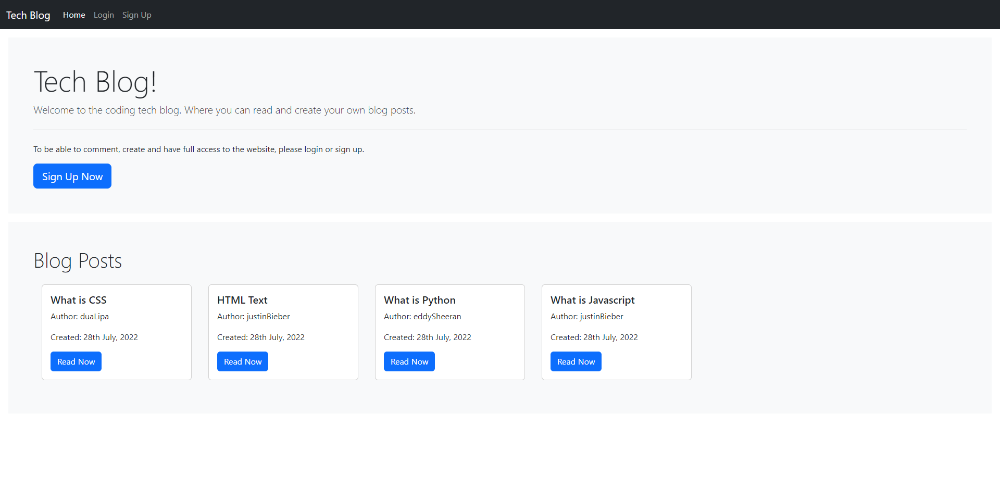
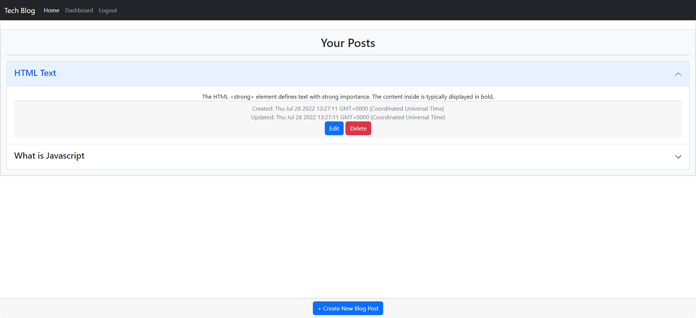

# Tech Blog

An application where users can log in to view, create, edit and delete blog posts. As well as comment on a post. If a user isn't logged in, then posts can still be viewed but the user won't be able to create posts or comments.

# Links To The Project

Feel free to check out the Heroku link for the Tech Blog [Deployed Heroku URL](https://tech-blog-jh22.herokuapp.com/)


# Installation

To run the application follow the installation process of cloning the repo

```
git clone git@github.com:glowingmanagement/tech-blog.git
```

Change directory into new cloned repo

```
cd tech-blog
```

Open an integrated terminal from the src folder and enter the following commands

```
mysql -u root -p
(enter your password)
source src/db/schema.sql
quit
```

Open a terminal from the root and enter the following command

```
npm run start
```


# Technologies Used

Application uses a Node.js and Express.js back end and uses both GET and POST routes for retrieving and adding new data.

Application has a folder structure that meets the MVC paradigm and uses Handlebars.js as the template engine.

Application is backed by a MySQL database with a Sequelize ORM and protects API keys and sensitive information with environment variables.

Application includes user authentication (express-session and cookies).


# Screenshots

Please see the various screenshots of the different pages:

# Home Viewport



# Blogs Viewport


